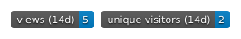

# unique-visitors-badge


## Описание

**Сколько на самом деле людей заходят на твой GitHub-профиль?** Обычные счётчики показывают хиты — число просмотров, а не уникальных посетителей. Один человек, открывший страницу 10 раз, превращается в 10 «посетителей».

Этот проект показывает **честную цифру**: автообновляемый бейдж **уникальных** посетителей страницы профиля GitHub, построенный на официальном GitHub Traffic API.

Бейджи вроде `visitor-badge.laobi.icu` считают **хиты** (просмотры страницы), а не уникальных пользователей: GitHub проксирует изображения README через Camo, подменяя IP и cookie, поэтому сторонние сервисы физически не могут определить уникальных посетителей.

Этот проект решает проблему честно: GitHub Traffic API возвращает реальные `uniques` (уникальные посетители) и `count` (просмотры) за последние 14 дней, а GitHub Actions раз в день снимает срез и накапливает историю. На профиле стоят **два бейджа**: «views (14d)» — просмотры за окно 14 дней (растут с каждым визитом) и «unique visitors (14d)» — честные уникальные посетители. Оба в стиле shields.io — как остальные бейджи профиля.

**Как это выглядит (результат):**



⭐ **Полезно? Поставь звезду** — автору приятно и проекту больше доверия.
🍴 **Нужно для своего профиля? Форкни** и следуй инструкции ниже.
💡 **Есть идея? Открой Issue или Pull Request** — автор отвечает.

## Почему это интересно (ход мысли)

1. **Проблема**: бейдж визитов считает хиты, а не уникальных. Хиты растут при каждом открытии README, даже одним человеком.
2. **Корень проблемы — Camo**: GitHub проксирует изображения в README, подменяя IP и cookie. Поэтому сервисы-бейджи не могут считать уникальных по IP — они видят только IP прокси GitHub.
3. **Открытие**: у GitHub есть Traffic API для репозиториев — `GET /repos/{owner}/{repo}/traffic/views` возвращает `count` и `uniques` за последние 14 дней. Это официальные данные, которые знает сам GitHub.
4. **Ограничение**: данные хранятся только 14 дней → без регулярных срезов статистика теряется. Решение — раз в день накапливать историю в `traffic_history.json`.
5. **Бейджи**: из среза генерируются `badge.json` (уникальные) и `views.json` (просмотры) по schema shields.io endpoint badge, и в README ставятся `https://img.shields.io/endpoint?url=...` — стиль совпадает с остальными бейджами профиля.
6. **Честная метрика**: «unique visitors (14d)» + «views (14d)». Суммировать уникальных из разных окон нельзя из-за пересечений — показываем актуальное окно.

## Установка / Запуск

Для владельца профиля (скопировать в свой аккаунт):

1. Создать репозиторий `unique-visitors-badge` (или форкнуть этот).
2. Добавить секрет **`GH_TOKEN`** в `Settings → Secrets and variables → Actions` — PAT с доступом к целевому репозиторию (чью статистику считаем, например `OWNER/OWNER` для README профиля).
3. Скопировать файлы: `.github/workflows/update-badge.yml`, `scripts/update_traffic.py`.
4. Указать целевой репозиторий в настройках workflow/скрипта (переменная `TARGET_REPO`).
5. В README профиля добавить бейджи:

```markdown


```

Запуск:

```bash
# ручной запуск workflow из Actions → Update traffic badge → Run workflow
# либо дождаться ежедневного cron (по расписанию)
```

## Структура проекта

```
unique-visitors-badge/
├── .github/
│   └── workflows/
│       └── update-badge.yml     # ежедневный cron + workflow_dispatch
├── scripts/
│   ├── update_traffic.py        # сбор Traffic API + генерация badge.json и views.json
│   └── analytics.py             # аналитика из истории + генерация analytics.json
├── examples/
│   └── badges-result.svg        # скрин результата (бейджи на профиле)
├── badge.json                   # «unique visitors (14d)» для shields.io endpoint
├── views.json                   # «views (14d)» для shields.io endpoint
├── analytics.json               # лаконичные метрики за 7/30 дней / всё время
├── traffic_history.json         # накопленная история срезов (views/clones)
├── README.md
└── LICENSE
```

## Решения (ADR-lite)

| Проблема | Решение | Почему |
|---|---|---|
| Camo-прокси не даёт считать уникальных по IP | GitHub Traffic API | Официальные данные о `uniques` знает только сам GitHub |
| Данные трафика хранятся 14 дней | Накопление истории в `traffic_history.json` | Без регулярных срезов статистика теряется |
| Суммировать уникальных из окон нельзя (пересечения) | Метрика «unique visitors (14d)» | Честная цифра за актуальное окно, без завышения |
| «Счётчик визитов» не растёт (уникальные почти не двигаются) | Второй бейдж «views (14d)» (`views.json`) | Просмотры растут с каждым визитом — видно активность, уникальные остаются честной метрикой |
| Единый стиль бейджей профиля | shields.io endpoint badge | `img.shields.io/endpoint?url=badge.json` — тот же стиль, что и остальные бейджи |
| Доступ к Traffic API | Секрет `GH_TOKEN` (PAT) | Токен не попадает в логи и не публикуется в репозитории |

## Аналитика

`scripts/analytics.py` строит **лаконичную аналитику** из накопленной `traffic_history.json` (запускается после каждого среза в том же workflow) и пишет `analytics.json`.

Что считается (честно, с учётом 14-дневного окна API):

| Метрика | Что значит | Точность |
|---|---|---|
| `last_count / last_uniques` | Актуальное окно 14 дней (последний срез) | точное (по данным GitHub) |
| `max_count / max_uniques` | Максимум в 14-дневном окне за период | оценка охвата за период |
| `sum_count` | Сумма `count` по срезам за период | **верхняя граница** — окна пересекаются, один хит попадает в ~14 срезов |
| `trend` | Список срезов: дата → views/clones uniques | точное по срезам |

Периоды: `all` (всё время), `last_30d`, `last_7d`.

**Чего не умеет и почему:** точных «уникальных за месяц/год» GitHub не хранит и не отдаёт (только скользящее окно 14 дней). Поэтому честный максимум, который даёт проект: тренд, оценка охвата (`max_uniques` за период) и верхняя граница активности (`sum_count`). Для точной помесячной аналитики нужен свой сайт с JS-аналитикой (Plausible, Umami, GA) — см. FAQ.

Пример `analytics.json` (срез 2026-08-15, история 2 дня):

```json
{
  "generated": "2026-08-15",
  "period": {"start": "2026-08-04", "end": "2026-08-13", "samples": 2},
  "all": {"samples": 2, "views": {"last_count": 2, "last_uniques": 1, "max_count": 2, "max_uniques": 1, "sum_count": 3}},
  "trend": [
    {"date": "2026-08-04", "views_uniques": 1, "clones_uniques": 0},
    {"date": "2026-08-13", "views_uniques": 1, "clones_uniques": 2}
  ]
}
```

## Ограничения и частые вопросы (FAQ)

> ⚠️ **Если ты форкнул этот репозиторий — прочитай это первым.**
> Счётчик **не обновляется мгновенно**. После того как кто-то зашёл на страницу, цифра на бейдже меняется с **тройной задержкой**:
>
> 1. **GitHub Traffic API обновляется с лагом ~1 час** (иногда дольше) — заход появляется в API не сразу.
> 2. **Workflow снимает срез каждый час** (в начале часа, UTC). Между срезами бейдж показывает прошлое значение.
> 3. **Бейдж кэшируется до 1 часа** (`cacheSeconds: 3600`) — shields.io и GitHub Camo держат старую картинку.
>
> Итого: от захода до новой цифры на бейдже обычно проходит **~2–3 часа**. Это нормально и не значит, что счётчик сломан.
> Проверять актуальные данные лучше по `badge.json` / `views.json` / `analytics.json` в репозитории — они обновляются раньше, чем картинка.

**Почему цифра на бейдже не растёт, хотя я заходил на страницу?**

1. **Свои визиты не считаются.** GitHub Traffic API **не учитывает просмотры владельца** репозитория. Заход на свой профиль (даже из другого браузера или с другого своего аккаунта, если это один и тот же человек) не попадает в статистику. Бейдж показывает только **других** посетителей.

2. **Traffic API обновляется с задержкой.** GitHub агрегирует данные трафика не мгновенно — свежий заход появляется в API обычно через **~1 час** (иногда дольше).

3. **Бейдж обновляется каждый час.** Workflow снимает срез по расписанию: **в начале каждого часа (UTC)**. Между срезами бейдж показывает прошлое значение. Запустить вручную: `Actions → Update traffic badge → Run workflow`.

4. **Бейдж кэшируется.** В `badge.json` / `views.json` стоит `cacheSeconds: 3600` — shields.io и GitHub Camo кэшируют картинку **до 1 часа**. Даже после обновления файлов цифра на бейдже может обновиться с задержкой.

5. **Это метрика за 14 дней.** Бейдж показывает «unique visitors (14d)» — уникальных за последние 14 дней (скользящее окно). Если человек уже заходил в этом окне, повторный заход цифру не увеличит. Суммировать окна нельзя — они пересекаются.

> 💡 **Хочешь видеть рост?** Смотри бейдж **«views (14d)»** — просмотры растут с каждым визитом (кроме своих). Уникальные — это честная метрика охвата, она двигается медленнее.

**Можно ли сделать период больше 14 дней (месяц, год)?**

GitHub Traffic API отдаёт данные только за последние **14 дней** — это ограничение самого GitHub, обойти его через API нельзя. Но проект каждый день накапливает срез в `traffic_history.json`, поэтому через месяц/год у тебя будет **собственная история за любой период**. Из неё `analytics.py` строит:
- **тренд посещаемости по дням** (`trend`) — самое ценное для аналитики;
- **оценку охвата** — `max_uniques` в 14-дневном окне за период;
- **верхнюю границу просмотров** — `sum_count` по срезам за период.

⚠️ **Важно про `sum_count`:** его нельзя называть «суммой просмотров за месяц». Каждый хит попадает в ~14 срезов (окна пересекаются), поэтому `sum_count` завышен — это верхняя граница активности, а не точное число просмотров.

Точное число «уникальных за месяц» GitHub не хранит и не отдаёт — уникальные видны только как скользящее окно 14 дней. Для точной помесячной аналитики нужен свой сайт с JS-аналитикой (Plausible, Umami, Google Analytics, Яндекс.Метрика) — там cookie/идентификатор позволяют считать уникальных за любой период.

**Как проверить, что счётчик работает?**

- Открой свою страницу **с чужого аккаунта** (или в приватном окне без логина в GitHub).
- Подожди **1+ час** (задержка Traffic API).
- Дождись следующего часового среза workflow (или запусти вручную).
- Обнови бейдж (или посмотри `badge.json` / `views.json` в репозитории — там данные обновляются раньше, чем на картинке).

**Где посмотреть «сырые» данные?**

- `badge.json` в репозитории — актуальные уникальные посетители (14d), которые подхватывает shields.io.
- `views.json` в репозитории — актуальные просмотры (14d), которые подхватывает shields.io.
- `traffic_history.json` — накопленная история срезов (view только у владельца).
- `analytics.json` — сводные метрики за 7/30 дней и всё время + тренд (генерирует `analytics.py`).

## Стек

- Python — сбор трафика, генерация `badge.json`, `views.json` и `analytics.json`
- GitHub Actions — расписание (cron) + ручной запуск (`workflow_dispatch`)
- GitHub REST API — `traffic/views`, `traffic/clones`
- shields.io — endpoint badge
- JSON — хранение данных и обмен с shields.io
- git — версионирование и публикация

## Лицензия

MIT

## Контакты

Дмитрий (DAYT-43) — https://github.com/DAYT-43

---

### 🚀 Установи честный счётчик себе на профиль

1. ⭐ **Поставь звезду** — это лучший способ сказать «спасибо» и помочь проекту.
2. 🍴 **Форкни** репозиторий и пройди шаги из раздела «Установка / Запуск».
3. 💡 **Предложи улучшение**: новые метрики (clones, source/referrer), другой стиль бейджа, графики — открывай Issue или Pull Request. Автор активно дорабатывает.

Спасибо, что заглянул! 🙌
